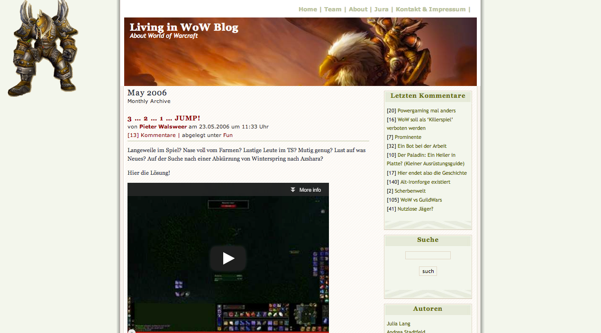

	<section>
		<h2>Living in WoW</h2>
		
Meine Beitr&auml;ge zu einem Blog rund um World of Warcraft in den Jahren 2005 bis 2007.

		 <small><em>Screenshot</em></small>
	</section>
	<section>
		<h4>Archived entries</h4>
		<table>
			
			<tr><td><small>{{ post.date | date_to_long_string }}</small></td><td> &#160; <a href="{{ post.url }}">{{ post.title }}</a></td></tr>
		</table>
	</section>

