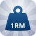

	<section>
		
		<h2>1RM Tracker</h2>
		The perfect companion app to track your CrossFit 1RM's.
		 
	</section>
	<section>
		<em>Currently in closed beta</em>

		<h3>Features</h3>
		<ul>
			<li>Track all Weightlifting exercises (Olympic, Powerlifting, etc.)</li>
			<li>Show percentage breakdown for scaled workouts</li>
			<li>Supports both Metric and Imperial format</li>
		</ul>

		<h3>Future updates</h3>
		<ul>
			<li>History & Charts</li>
			<li>Weight disc setup needed for scaled exercises</li>
			<li>Track other types of exercise, e.g. "The Girls" or the Hero WOD's</li>
			<li>more localizations</li>
		</ul>
	</section>
	<section>
		<strong>Note:</strong>
		1RM Tracker is not affiliated with CrossFit, Inc in any way nor is it endorsed by CrossFit, Inc or any of its subsidiaries. CrossFit is a registered trademark of CrossFit, Inc.
	</section>

